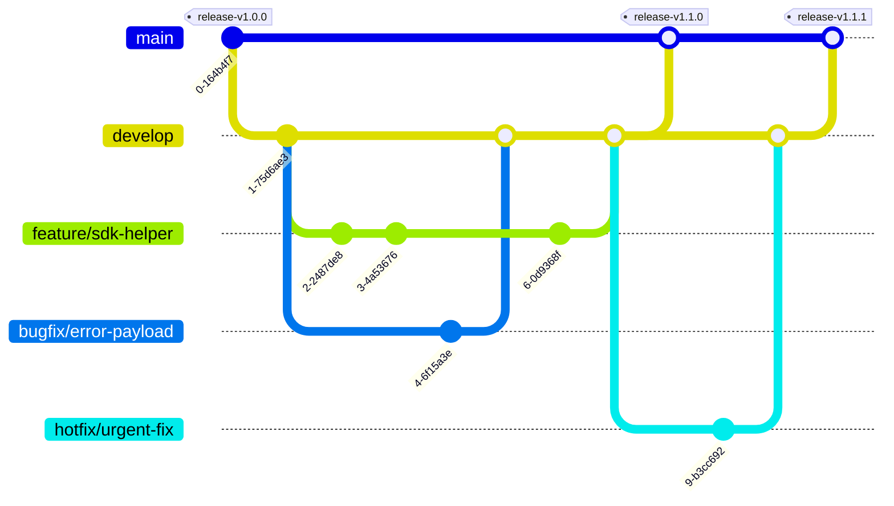

# Development Flow

This page describes the recommended day-to-day development workflow for
`oqtopus-client`.

The examples below assume a two-branch model:

- `main` is the release branch
- `develop` is the day-to-day integration branch

## Branch Strategy

Create short-lived topic branches from `develop`, then merge them back through
a pull request. Releases are promoted from `develop` to `main`.



### Branch Naming

Recommended naming:

- `feature/<name>` for new features
- `bugfix/<name>` for bug fixes
- `hotfix/<name>` for urgent fixes
- `docs/<name>` for documentation-only work
- `refactor/<name>` for internal cleanups without behavior changes

Examples:

- `feature/generated-api-reference`
- `bugfix/retry-status-codes`
- `docs/setup-guide-refresh`

## Recommended Workflow

For most changes, the following flow keeps diffs small and reviewable.

1. Update your local `develop`.
2. Create a focused branch.
3. Implement the change.
4. Run the minimum relevant checks.
5. Update docs and generated outputs when needed.
6. Open a pull request with enough context for reviewers.

Example:

```bash
git switch develop
git pull --ff-only
git switch -c feature/generated-api-reference
uv sync --all-extras
make check
make docs
```

## Change Types

### Regular Python Changes

For changes under `src/oqtopus_client/services/`, `tests/`, `examples/`, or
docs:

- keep the change focused on one behavior or one contributor task
- add or update tests for behavior changes
- update usage docs when the public API changes
- run `make check` before opening the PR

### OpenAPI-Generated Client Changes

The generated client under `src/oqtopus_client/rest/` should never be edited by
hand.

When generated code must change:

1. update the source OpenAPI definition
2. regenerate the client
3. review the generated diff carefully
4. include the generation command in the PR description

Typical flow:

```bash
make download-oas
make generate-models
make check
make docs
```

If you need to point at a different OpenAPI source during development:

```bash
make -C spec download-oas \
  OAS_URL=https://raw.githubusercontent.com/oqtopus-team/oqtopus-cloud/main/backend/oas/user/openapi.yaml
make -C spec generate-models \
  OAS_FILE=openapi.yaml \
  MODEL_OUTPUT_DIR=../src/oqtopus_client/rest
```

When generated code changes, reviewers should be able to tell:

- why the source API changed
- which command regenerated the client
- whether any hand-written wrappers or tests were updated to match

## Validation Before PR

Run the smallest meaningful set of checks, but prefer the full set before
requesting review.

### Core checks

```bash
make lint
make typecheck
make test
```

### Combined check

```bash
make check
```

### Documentation checks

```bash
make docs
make docs-serve
```

Use `make docs` when changing docs, API reference generation, docstrings, or
MkDocs configuration. It runs strict validation and catches broken links and
navigation issues.

## Commit Messages

Use [Conventional Commits](https://www.conventionalcommits.org/en/v1.0.0/) when
possible.

Recommended prefixes:

- `feat:` new feature
- `fix:` bug fix
- `docs:` documentation changes
- `refactor:` internal refactor without behavior change
- `test:` new or updated tests
- `ci:` CI or automation changes
- `chore:` maintenance work

Examples:

- `feat: add generated openapi reference landing pages`
- `fix: stop retrying 5xx responses by default`
- `docs: expand development flow guide`
- `test: cover device_info json parsing`

### Optional local commit template

This repository includes a `.gitmessage` template. To enable it locally:

```bash
git config --local commit.template .gitmessage
```

After that, `git commit` opens a ready-to-edit template in your editor.

## Pull Requests

Keep pull requests focused and easy to review.

Recommended PR contents:

- related ticket or issue, if any
- short summary of what changed
- validation results such as `make check` or `make docs`
- related PRs, especially when the change depends on OAS updates elsewhere

For `oqtopus-client`, also call out the following when relevant:

- public API changes
- renamed helpers or breaking changes
- generated code updates under `src/oqtopus_client/rest/`
- documentation updates for examples, setup, or API reference

### PR Checklist

- the branch is scoped to one topic
- tests were added or updated for behavior changes
- docs were updated for user-facing changes
- generated files were regenerated instead of manually edited
- `make check` passed, or any skipped checks are explained
- `make docs` passed for doc or docstring changes

## Merge Policy

Prefer a clean history on both `develop` and `main`.

- Use `Squash and merge` for most `develop` <- topic branch PRs.
- Use a regular merge commit for `main` <- `develop` release promotions.
- Keep the PR title or squash commit message in Conventional Commits style.
- Avoid mixing unrelated generated diffs and hand-written refactors in one PR.

## Review Tips for Generated Diffs

Generated diffs can be noisy, so review them separately from hand-written code
when possible.

A practical pattern is:

1. review `spec/` or the upstream OAS source change first
2. review generated code under `src/oqtopus_client/rest/`
3. review wrapper logic under `src/oqtopus_client/services/`
4. review tests, examples, and docs last

This makes it much easier to see whether the generated client and the
hand-written SDK layer still match.
