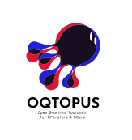

# OQTOPUS Client

Python client SDK for the OQTOPUS Cloud User API.

## Overview

**OQTOPUS Client** provides a typed Python interface for OQTOPUS Cloud User API.

- Submit and manage jobs from Python.
- Use generated Pydantic models for request/response validation.
- Handle authentication using API token strings with constructor, environment variables, or config profiles.
- Core client usage does not require any other quantum software SDK.
- OpenAPI-generated models are used internally, while helper APIs such as `OqtopusJobSpec` and `run_*` reduce boilerplate.
- Internal HTTP communication is asynchronous, with an easy-to-use synchronous public API.
- Built-in retry/backoff controls and typed result wrappers support stable operation.

## Usage

- [Getting Started](./usage/getting_started.md)
- [OQTOPUS Client Examples](https://github.com/oqtopus-team/oqtopus-client/tree/main/examples)

## API reference

- [API Reference](./reference/)

The API reference section is generated automatically from source code and organized by module.

## Developer Guidelines

- [Development Flow](./developer_guidelines/index.md)
- [Setup Development Environment](./developer_guidelines/setup.md)
- [How to Contribute](./CONTRIBUTING.md)
- [Code of Conduct](https://oqtopus-team.github.io/code-of-conduct/)
- [Security](https://oqtopus-team.github.io/security-policy/)
